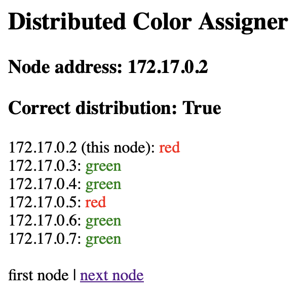
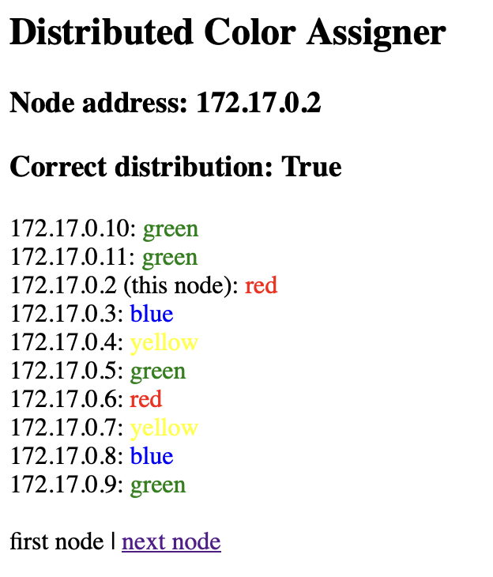
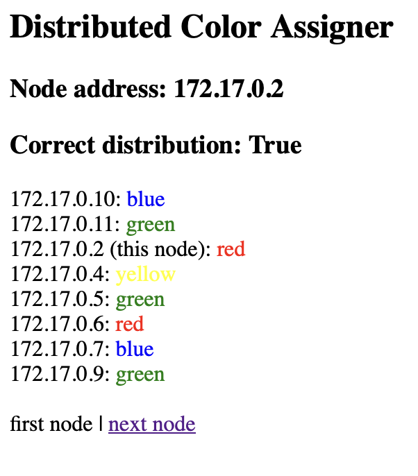

# Distributed Color Assigner
KIV/DSA semestral work - distributed algorithm that assigns each node a color based on a common configuration

## Task
Implement a distributed application (algorithm) for the "coloring" of N identical nodes, where N is a parameter whose value can be chosen before launching the entire application.

The goal is to "color" 1/3 of the nodes as "red" and the remaining 2/3 as "green", with the number of "red" nodes rounded up.

## Features
- **Node creation using Vagrant and Docker:**  
  Each node runs in its own isolated environment, as a Docker container. Docker images are dynamically built and containers started by Vagrant.

- **UDP multicast communication:**  
  Nodes discover each other and exchange color state information using UDP multicast communication.

- **Automatic color selection:**  
  Each node chooses its color on startup based on the configured target distribution, and dynamically adjusts it if needed to converge to the desired balance.

### In addition to the task assignment

- **API displaying results using Flask:**  
  Each node runs a simple HTTP server showing its current color, colors of other detected nodes, and navigation links to adjacent nodes.

- **Support for multiple colors:**  
  The system supports any number of colors, not just red and green. Colors and their desired proportions can be configured easily, and the distributed algorithm will automatically converge to the correct ratio across all active nodes.

- **Node failure/disconnect detection:**  
  Nodes monitor each other and detect any that stop sending updates after a timeout, triggering recalculation of the target distribution.

- **Parameter configuration:**  
  Distribution ratios, multicast settings, timeouts, and verbosity can be customized in `config.py`.

## Algorithm
1. **Initialization:**
    - Each node identifies its own IP address using a discovery multicast message.
    - A random initial color is selected based on the weighted distribution from `config.py`.

2. **Communication:**
    - Nodes listen for color updates via multicast and track the last-seen timestamp of every peer.
    - On each interval, a node sends its current color to all others.
    - Nodes communicate by sending messages in the `json` format.

3. **Distribution Adjustment:**
    - Each node calculates the target (`target_dist`) and actual (`actual_dist`) color distributions - counts of nodes that should have each of given colors.
    - If the actual distribution differs, a probabilistic algorithm decides whether the node should switch colors to help converge to the target.
        - First, node calculates the probability of changing its color using the following formula:
            ```
            P(change) = 1 - target_dist(color) / actual_dist(color)
            ```
            (color is node's current color)

        - If node then chooses to change color with this probability, probabilities of each color node can change to are calculated using the following formulae:
            ```
            diff(color) = actual_dist(color) - target_dist(color)
            ```
            (calculated for each color)

            ```
            ideal_changes = sum(diff(color) where diff(color) > 0)
            ```
            (ideal number of nodes that should change color given the state of current distributions)
            ```
            P(color) = -diff(color)/ideal_changes ... if diff(color) < 0
            P(color) = 0  ... otherwise
            ```
            (probability of changing to each of given colors)

        - Finally, new color of node is determined by randomly selecting based upon the probabilities. 


4. **Fault Tolerance:**
   - If a node hasn’t been heard from in a defined timeout, it is considered disconnected and removed from the local state.
   - Probabilistic algorithm then ensures that target color distribution is renewed.


## File Overview
- **main.py** – Entry point of the program. Initializes communication, launches the API server and color assignment logic in parallel.
- **communication.py** – Handles UDP multicast communication. Used for discovery and broadcasting color updates.
- **color_assigner.py** – Core logic for assigning and adjusting colors. Tracks other nodes, maintains local state, and ensures convergence to the correct distribution.
- **api.py** – Web interface built with Flask that displays the local node’s state and a summary of all visible nodes.
- **config.py** – Configuration file for multicast addresses, timing parameters, verbosity, and the target color distribution.

## Setup and Usage

### Requirements
- Docker
- Vagrant
- Python 3.x (installed on nodes automaticaly via Docker)
- Flask (installed on nodes automaticaly via Docker)

### Running the Project
1. Clone the repository.
    ```bash
    git clone https://github.com/jakubkrizanovsky/DistributedColorAssigner.git
    ```
2. Configure the number of desired nodes as needed in `Vagrantfile` by setting the variable `NODE_COUNT`.

3. Configure `config.py` as needed - mainly the desired distribution of colors by editing `COLOR_DITRIBUTION` dictionary values.

4. Build images and start containers using `Vagrant` by calling:
    ```bash
    vagrant up
    ```

5. Check the `HTTP API` by default on address `localhost:8081` and increasing port numbers.

6. You can try taking down a few nodes e. g. by calling:
    ```bash
    vagrant halt node-3
    ```

7. When done, clean up the containers by calling:
    ```bash
    vagrant destroy -f
    ```

## Example Behaviour

### Scenario 1
Matches the distribution in task assignment.

#### Config
- node count: 6 (configured in Vagrantfile)
- target distribution:
```python
COLOR_DITRIBUTION = {   
    "green": 2,
    "red": 1
}
```
(configured in `confing.py`)

#### Results 

Results by connecting to `localhost:8081` using a web browser:


You can see that two nodes are red (nodes 1 and 4) and four green (nodes 2, 3, 5 and 6) matching the target distribution.

After stopping node-4 (red) by running:
```bash
vagrant halt node-4
```


You can see that `node-5` successfully changed color to red to keep target distribution.

### Scenario 2
More complicated scenario using five colors.

#### Config
- node count: 10
- target distribution:
```python
COLOR_DITRIBUTION = {   
    "green": 40,
    "red": 20,
    "blue": 20,
    "yellow": 20
}
```

#### Results 



After stopping nodes 2 and 7 (both blue ones):
